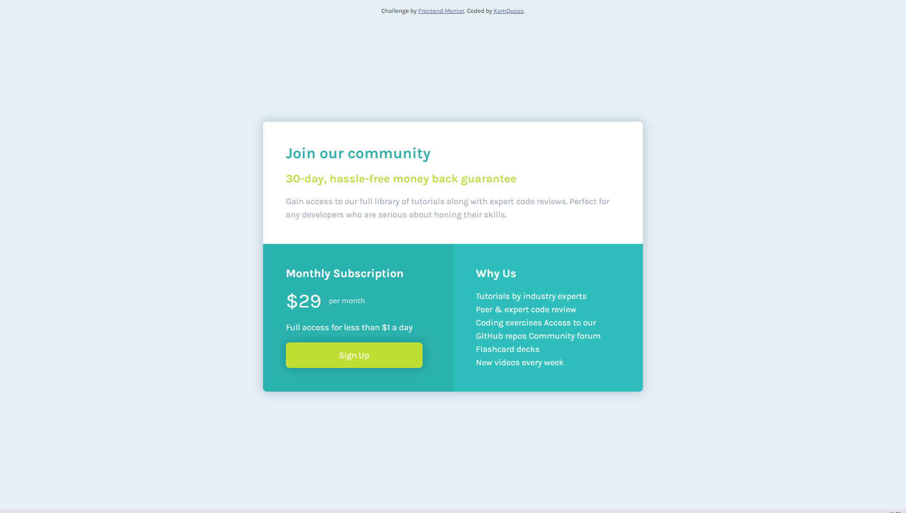

# Frontend Mentor - Single price grid component solution

This is a solution to the [Single price grid component challenge on Frontend Mentor](https://www.frontendmentor.io/challenges/single-price-grid-component-5ce41129d0ff452fec5abbbc). Frontend Mentor challenges help you improve your coding skills by building realistic projects. 

## Table of contents

- [Overview](#overview)
  - [The challenge](#the-challenge)
  - [Screenshot](#screenshot)
  - [Links](#links)
- [My process](#my-process)
  - [Built with](#built-with)
  - [What I learned](#what-i-learned)
  - [Continued development](#continued-development)
  - [Useful resources](#useful-resources)
- [Author](#author)

## Overview

### The challenge

Users should be able to:

- View the optimal layout for the component depending on their device's screen size
- See a hover state on desktop for the Sign Up call-to-action

### Screenshot



### Links

- Live Site URL: [here](https://kamquoss.github.io/single-price-grid-component-master/index.html)

## My process

### Built with

- Semantic HTML5 markup
- SCSS custom properties generated to CSS 
- Flexbox

### What I learned

- live preview with Live Server in VSCode
- compiling from SCSS files to CSS in VSCode with LiveSassCompiler
- basics of BEM methodology
- Sass variables, mixins, special functions
- css selector specificity
- css pseudo classes

```scss
@mixin rounded-corner($position, $size) {
    border-#{$position}-radius: $size;
}
```
```scss
h1 {
    color: $cyan;
    &:first-child {margin-top: 0;}
}
```
```scss
a {
    @include button;
    width: calc(100% - #{$block-padding})
}
```
### Continued development

I want to continue learning BEM methodology, and proper naming website elements.
I found very useful Sass variables and mixins. Definitely I will use them in my future projects.
Future reading: ARIA

### Useful resources

- [Box Shadow Generator](https://cssgenerator.pl/box-shadow-generator/) - This helped me to build nice shadow. I could instantly see which variables are responsible for appearance.
- [Adobe Color Wheel](https://color.adobe.com/pl/create/color-wheel) - This helped me to find additional colors.
- [centering things with CSS](https://www.freecodecamp.org/news/how-to-center-anything-with-css-align-a-div-text-and-more/) - How to center things on page.

## Author

- LinkedIn - [Kamila Kłosek](https://www.linkedin.com/in/kamila-k%C5%82osek-b16b08a7/)
- Frontend Mentor - [@yourusername](https://www.frontendmentor.io/profile/yourusername)
